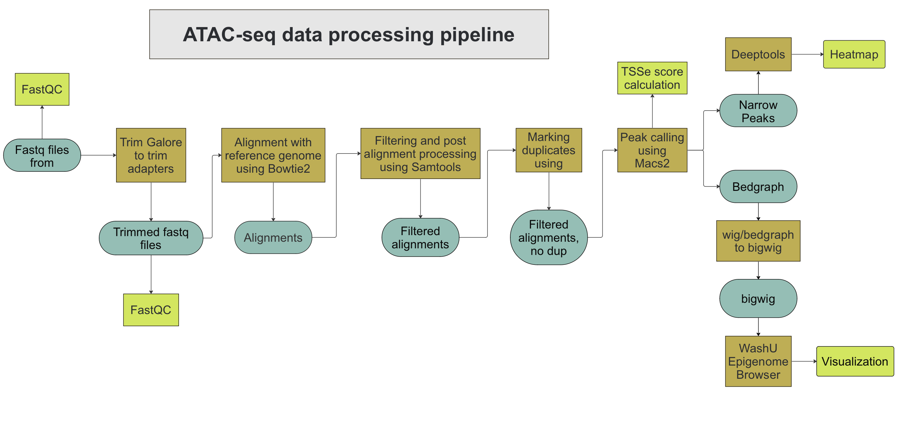

# ATACSeq Data Processing Pipeline using NextFlow
This is an automated workflow pipeline for analyzing and processing ATAC-seq data, implemented primarily in bash, and wrapped in a NextFlow workflow to characterize the chromatin landscape in bulk ATAC-seq samples. Here are the steps for data processing:
1. [Completed] Running Trim galore to cut the adapters
2. [Completed] Running alignment to the reference genome using Bowtie2
3. [Completed] Running filtering using Samtools
4. [Completed] Running mark duplicates using picard
5. [Completed] Running peak calling using MACS2
6. [In-progress] Calculating TSSe score
7. [In-progress] Generating bigWig and heatmap using Deeptools



This tool is used to process bulk ATAC-seq data by mapping paired-end reads to a reference genome and identifying areas of open chromatin after peak calling. This tool generates files that can be visualized on a genome browser. 

Running the tool is pretty straight forward, however a good understanding of `bash` is recommended. Please familiarize yourself with data types, basic functions, data structures in each language.

## Installation/Setup of Visium NextFlow Pipeline:
You can install Visium NextFlow Pipeline via git:
```
git clone https://github.com/utdal/ATACSeq-NextFlow-Pipeline
```

To execute the tool, essential modifications need to be made to the file(s):
```
a) pipeline.config
b) atac_seq_samples.txt
```


#### Running the Tool
Here is an example of how to run the pipeline:
1. Command to run the pipeline:
   ```
   nextflow run atacseq_nextflow_pipeline.nf -c pipeline.config
   ```
2. Command to re-run from fail-point:
   ```
   nextflow run atacseq_nextflow_pipeline.nf -c pipeline.config -resume
   ```

The results generated should be in the `params.fastq_files = '/path/to/config/fastq_files'` directory, which was edited initially.
